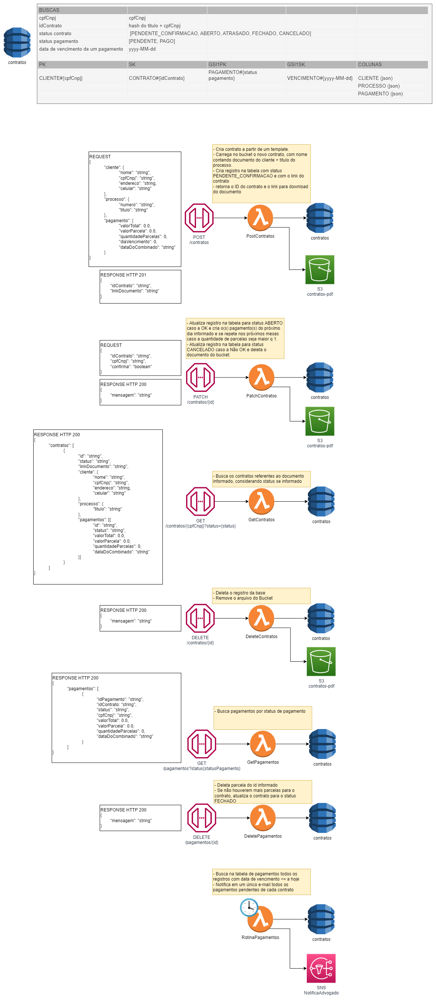

# Requisitos

- Usuário advogado especifica o nome de uma pessoa, título do processo e condições de pagamento combinada (ex: 10x de R$100,00 todo dia 5).
- Gera um link com um contrato template com os campos acima preenchidos.
- Usuário cliente acessa o link, que dá a ele o pdf para download e um botão de OK, que confirma o aceite do contrato, e um botão Não OK, que cancela o contrato.
- Sistema notifica o usuário advogado por e-mail referente à parcela pendente de pagamento daquele usuário cliente quando a data de vencimento chegar todos os dias, até que o usuário advogado entre no sistema e dê a baixa no pagamento.
- Usuário advogado dá a baixa na parcela pendente e para de receber a notificação por e-mail.

# Arquitetura proposta
